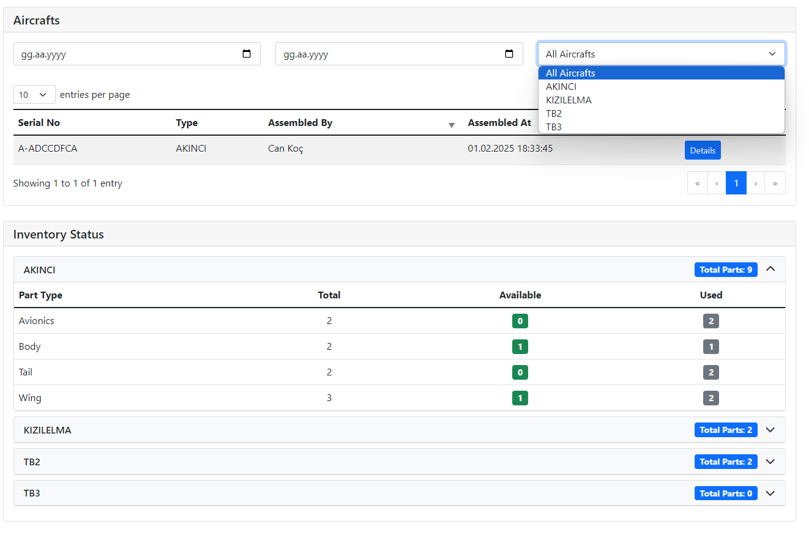

# Aircraft Manufacturing System

A Django-based system for managing UAV manufacturing processes. Includes parts production, inventory management, and UAV assembly processes.

## Features

-   User authentication and team-based authorization
-   Parts management based on team roles (create, list, delete)
-   Extendable team roles, parts and UAV models
-   UAV assembly with parts compatibility validation
-   Real-time inventory status tracking
-   Interface with serverside rendered DataTables
-   DRF RESTful API with Swagger and ReDoc documentation
-   Dockerized version (Supervisor, Gunicorn, Nginx, PostgreSQL)

## Screenshots

<table>
   <tr>
      <td style="width:50%"></td>
      <td style="width:50%"></td>
  </tr>
  <tr>
     <td></td>
      <td></td>
  </tr>
  <tr>
     <td></td>
      <td></td>
  </tr>
</table>

## Requirements

-   Python 3.10 or higher
-   SQLite (local) or PostgreSQL (Docker)
-   pip (Python package manager)

## Development Environment Setup

### 1) Clone the repository:

```bash
git https://github.com/buraketmen/aircraft-manufacturing-system.git
cd aircraft-manufacturing-system
```

### 2) Create and activate virtual environment:

```bash
python -m venv venv
source venv/bin/activate  # Linux/Mac
venv\Scripts\activate     # Windows
```

### 3) Install dependencies:

```bash
pip install -r requirements.txt
```

### 4) Set up database:

```bash
python manage.py makemigrations
python manage.py migrate
```

### 5) Create superuser (optional)

```bash
python manage.py createsuperuser
```

### 6) Start development server:

```bash
python manage.py runserver 8000
```

## Production Environment (Docker, No SSL)

### 1) Set environment variables (optional):

```bash
export POSTGRES_DB=your_db_name
export POSTGRES_USER=your_db_user
export POSTGRES_PASSWORD=your_db_password
```

### 2) Deploy

```bash
cd deploy
docker compose up -d
docker compose build --no-cache # if need
```

## Access Points

-   Web Interface: http://localhost:8000
-   Admin Interface: http://localhost:8000/admin
-   API Documentation: http://localhost:8000/api
-   ReDoc Documentation: http://localhost:8000/docs

## Testing

```bash
python manage.py test --settings=aircraft_manufacturing.settings.test
python manage.py test accounts.tests --settings=aircraft_manufacturing.settings.test
python manage.py test assembly.tests --settings=aircraft_manufacturing.settings.test
python manage.py test inventory.tests --settings=aircraft_manufacturing.settings.test
```
